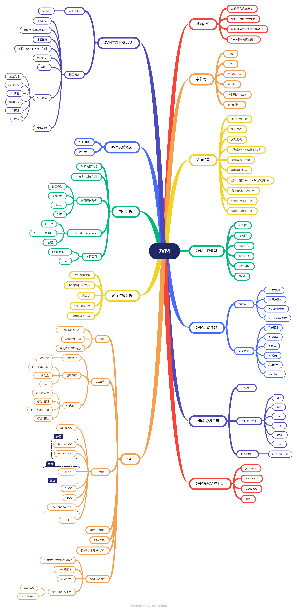
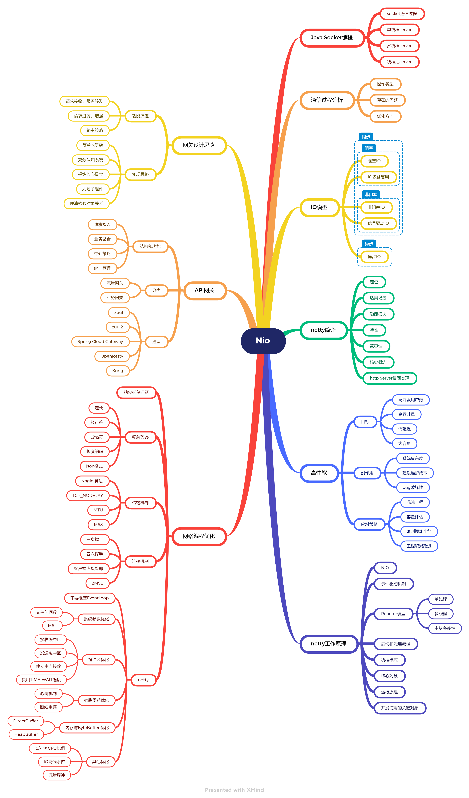
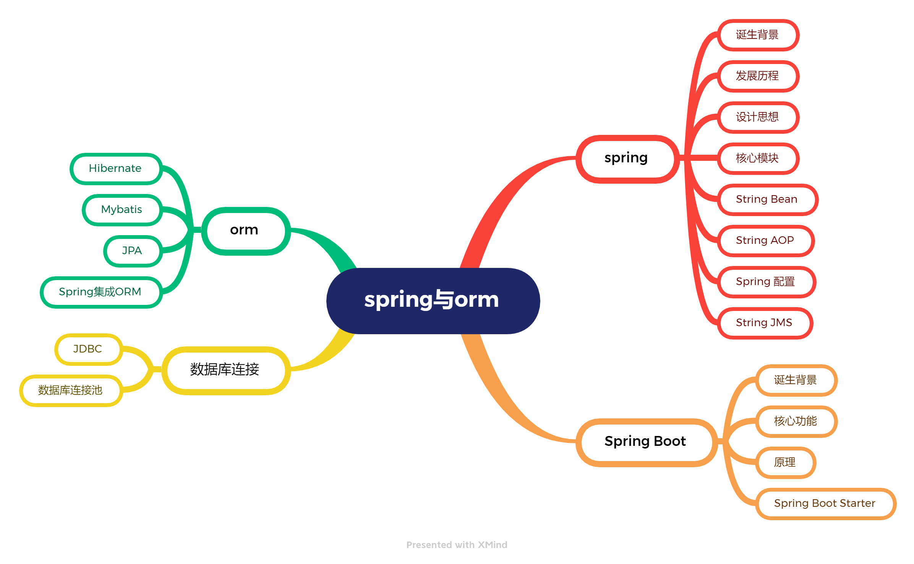
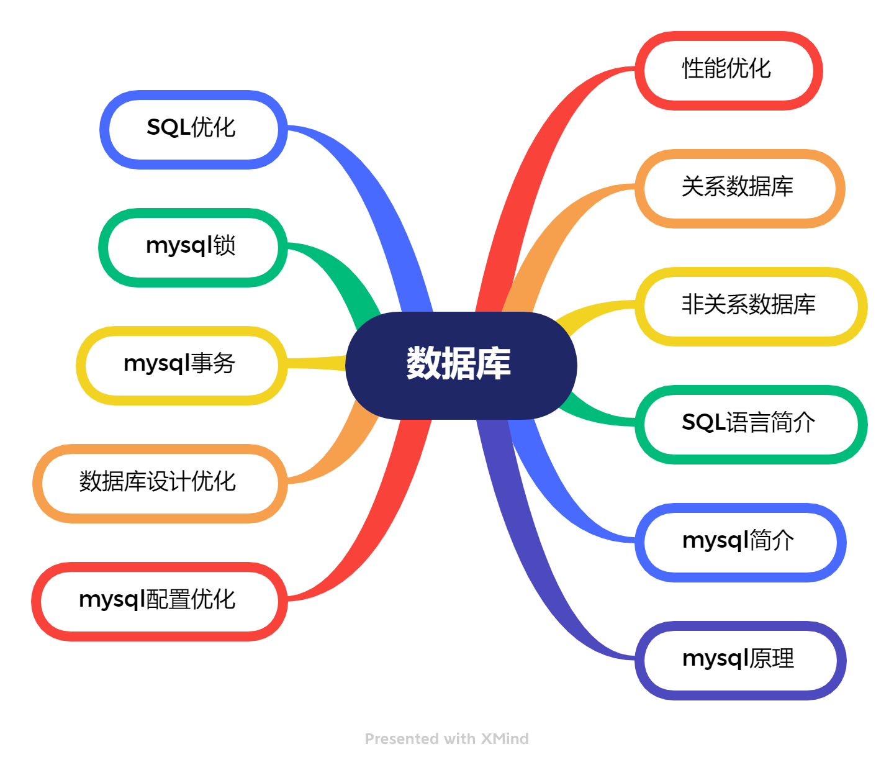
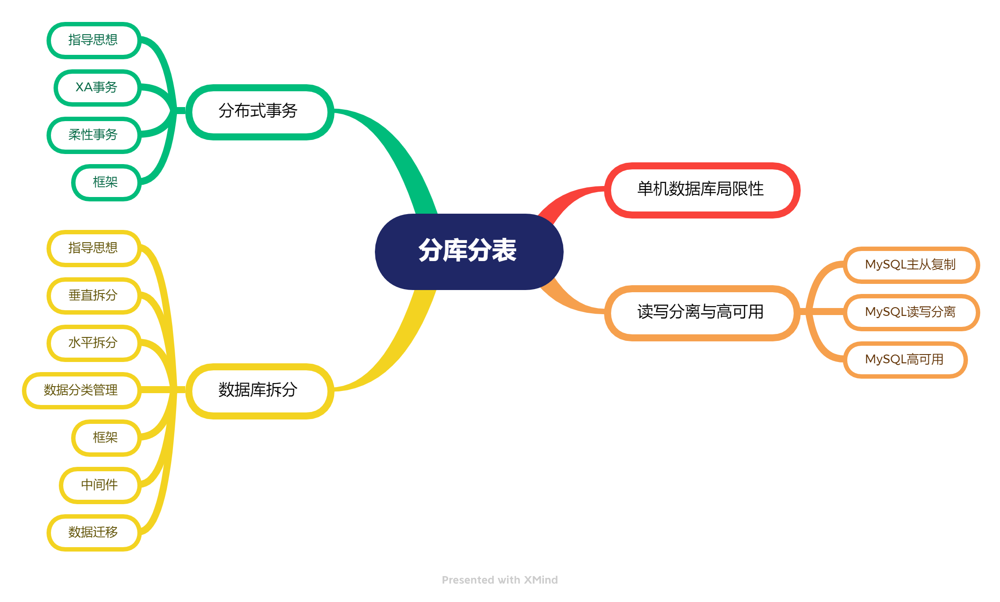
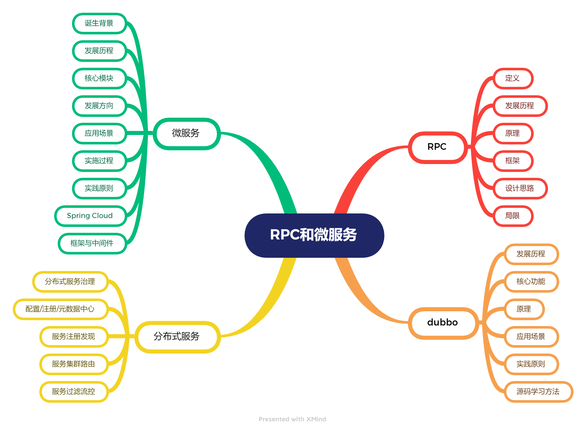
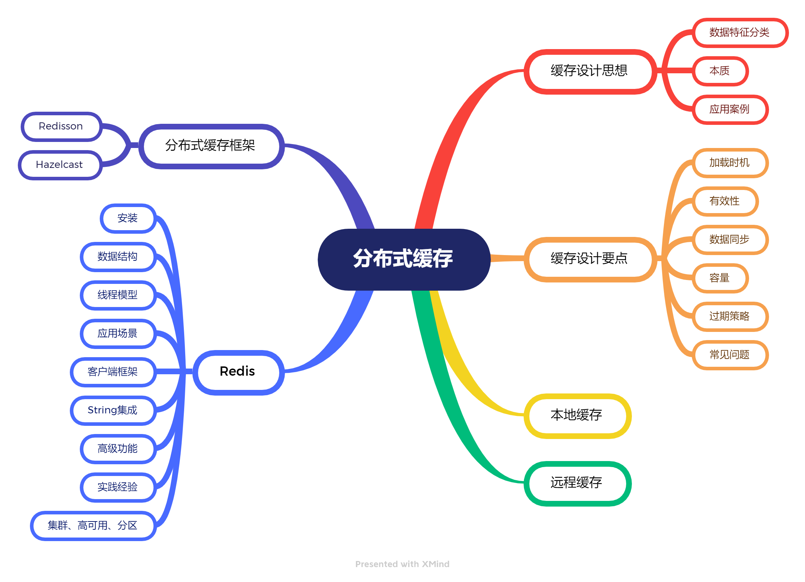
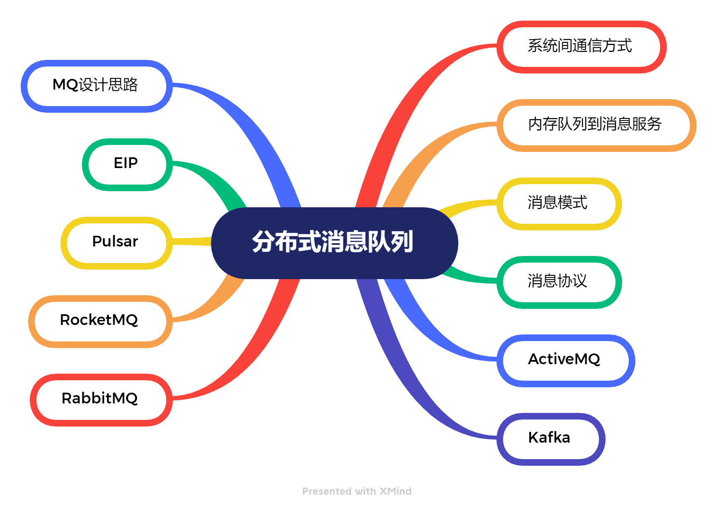

# JVM

JVM模块的重点内容是JVM内部的线程模型、内存模型、GC策略中各种核心概念、工作原理。难点是结合对JVM内部机制的理解与监控工具的使用完成JVM参数调优、问题排查等工作。进行JVM调优或问题排查时，可结合压测及各种指标的监控，从指标数据中分析jvm对应模块的运行情况，再进行一步寻找可以影响各模块行为的配置参数或代码，从而寻找到优化方向。

# NIO

NIO模块重点内容是5种IO模型，netty的主要功能、工作原理、开发应用。难点是对各种io模型、网络io的内部机制、netty运行原理的理解以及网络编程优化策略的应用。

该模块内容是我在整个课程中学习中觉得最难的模块。io模型这块比较抽象且描述的内容更偏向操作系统层面，netty这块是对底层NIO API的封装与增强。在这两部分知识之间，我欠缺了reactor模式和Java nio API的相关知识。感觉目前对该模块内知识的理解是存在断层的，无法形成整体认识，对netty工作原理、核心对象的理解还处于比较模糊的状态。需要在后续的学习中继续补充该领域的相关知识，再回过头来对目前所学进行消化和吸收。

# 并发编程

并发编程模块重点内容是理解线程、资源竞争、线程安全等并发编程中的核心概念，掌握java中并发编程api提供的能力和使用方式。难点是灵活使用并发编程API写出合理利用线程资源且线程安全的代码，以及并发场景下程序的异常排查。

我平时工作中主要采用的spring+servlet容器框架，其实就是在用线程池模式+贫血模型的无状态应用实现多线程编程，在此模式下，自己写的业务代码基本不需要考虑线程调度（servlet容器负责管理）和进程内的资源竞争（用到的都是方法局部变量，不在线程间共享）问题，资源竞争主要出现保存整个应用最终状态的数据库层面。这样降低了并发编程的复杂度，但是也导致线程资源利用率较低。因为习惯了这种开发模式，很少使用并发编程的api，所以会出现学完了不知道往哪用的问题，需要在后续的实践过程中多看看开源项目中对于这些api的应用，思考如何使用这些知识改进自己的业务代码实现。

# Spring 和 ORM 等框架

该模块重点内容是spring核心原理、spring boot 自动配置核心原理、spring与orm框架的集成使用。难点是对原理实现细节的深入理解以及将spring的工作模式灵活运用于开发实践中写出更加灵活且方便使用的业务组件。

spring是当之无愧的java体系胶水框架，它将我们在开发过程中用到各种组件提炼成了Bean的概念，配合描述bean的配置信息，对配置信息的解析和bean构建实现，极大地降低了我们对各种工具组件的集成与使用难度。spring bean为我们提供了在纵向依赖上的灵活组装方式，spring aop为我们提供了在横向增强方面的途径。如此一来，如果我们可以在设计自身代码时能做好抽象和结构分割，在后续的程序演进过程中，就能很方便地通过替换特定模块来扩展程序的能力。

# MySQL 数据库和 SQL

该模块重点内容是mysql数据库的执行流程、存储、索引、事务和锁等核心模块的工作原理，常用数据库操作场景的SQL优化思路与最佳实践经验。难点是运用这些知识完成好数据设计与操作层面的优化工作。

信息处理系统最基本的两大职能：将产生的数据收集存储起来，将存放的数据读取进行使用，而各种数据库系统就完成这两项工作的最常用工具。从业务系统数据到数据库系统最终存储结构的处理过程，涵盖了网络io、磁盘io、数据结构、内存、cpu计算等多个方面的协作，从表面看起来很简单，但如果向其中深挖会包含很多技术实现细节。数据量大的情况下，任何环节的不当用法都可能给系统性能造成负面影响，由此也就不难理解为什么说数据库相关的优化是业务系统性能优化的核心。所以，不断深化对其内部各环节实现原理的了解，根据实现原理找到具体问题的成因，针对成因选择合适的优化手段，才能更好完成数据库优化方面的工作。

# 分库分表

从这个模块开始，我们在Java领域内的知识体系就从单机范畴扩展到了分布式范畴。该模块的重点内容包括mysql数据库的读写分离、高可用、数据库拆分、分布式事务实现的指导思想和具体方法，难点在分布式事务和各种拆分方案落地的实现细节。分布式事务方案的选择需要结合业务场景特征做好一致性和性能之间的平衡，也需结合业务特点，合理运用各种无锁的并发安全设计方案来保障数据一致性。为了提升容量上限而引入的各种分布式方案，都给系统的设计、开发，尤其是后期的运维增加了难度。如果缺少配套分布式场景下的监控运维工具，会导致后期系统问题排查变得更加复杂。所以，如果打算要拆，就要在设计初期考虑到监控和问题排查辅助手段，如果缺失了这块，会造成系统拆分后问题排查效率严重下降。

# RPC 和微服务

业务系统的分布式化从RPC开始，向微服务演进。该模块的重点是RPC框架的原理与设计路、dubbo框架的原理、分布式服务治理、微服务技术体系。难点是微服务拆分、服务监控与治理措施的有效落地。在微服务治理监控领域，基于类似的设计指导思想，发展出来一堆五花八门的技术组件，每个组件深入学习起来东西都不少，典型的又多又杂。目前实际用过的只有很少一部分，而且对其内部实现的了解也不算深入，后续应该结合微服务体系的技术需求，针对每类需求选择一种市场上广泛应用的技术组件，对其使用和工作原理进行深入研究，以满足日常工作所需和技术深度要求。

# 分布式缓存

“商业的世界现金为王，数据的世界缓存为王”，缓存是软件设计中最为常用的系统提速优化方案之一。该模块的重点内容包括缓存设计的一般性指导思想与要点，本地与远程缓存的常用实现方案，redis常用功能。难点是根据业务场景设计合适的缓存方案，缓存的数据同步机制。加缓存也许很容易，但想要把缓存用好却很难，尤其在缓存数据可能存在变化加上分布式的场景中，如果缓存策略设计不够严谨就有可能出现各类找不到缓存、无效数据堆积、变更无法正常生效的问题。

# 分布式消息队列

消息队列，方法调用解耦、事件驱动模式应用的神器。该模块的重点是消息队列的设计思想、应用方式、通用协议，kafka的基本使用方式、工作原理、使用优化经验，其他常用mq中间件的特性与基本使用方式。难点是深入了解这些常用mq，掌握这些mq的调优参数和最佳实践方式。这部分也和微服务领域的技术组件类似，同类组件有多又杂，相似又各有差异，技术难度大学习成本高。还是得选一个应用最广泛的，用熟搞透它是怎么解决消息队列领域的共性问题，再以此为对比了解其他相似产品。

